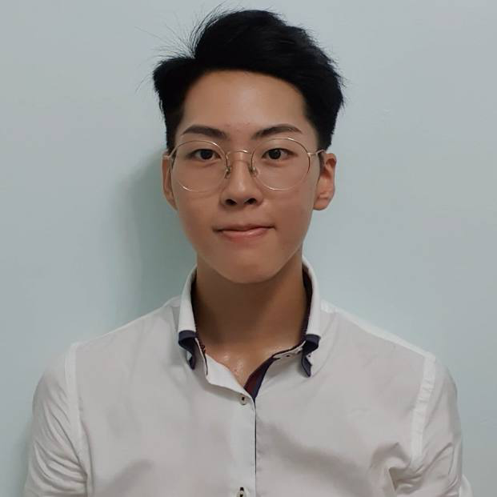
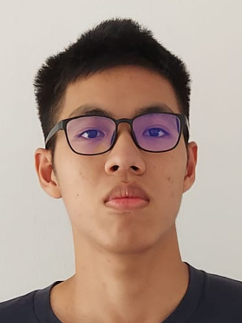
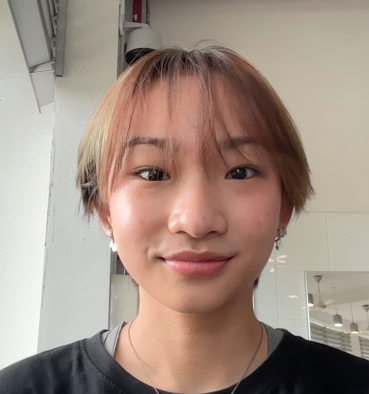
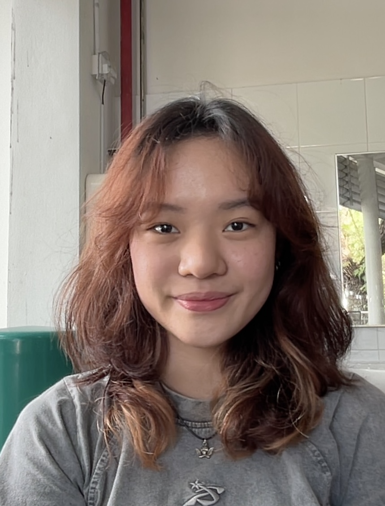
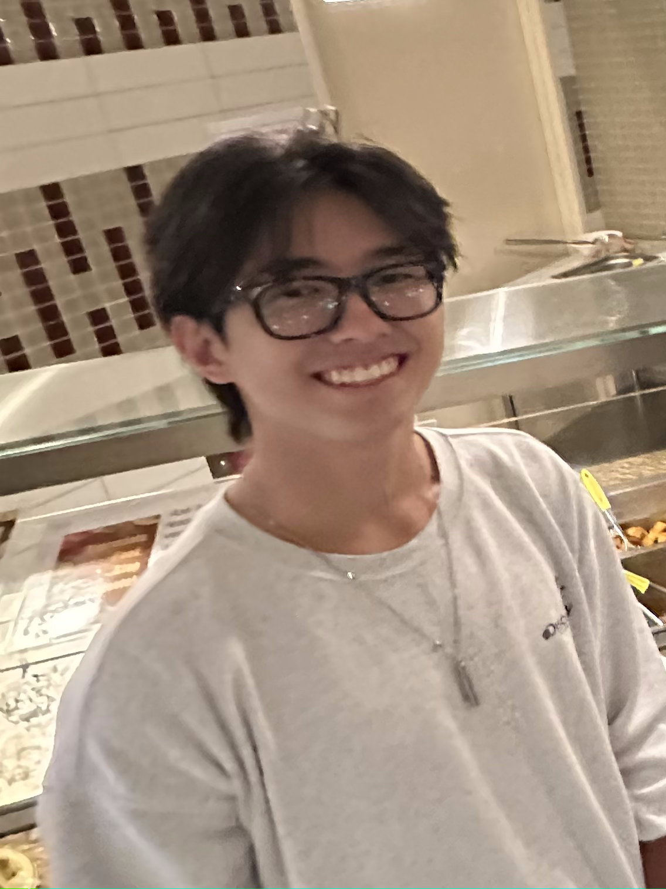

# About Us

We are a team based in the [School of Computing, National University of Singapore](http://www.comp.nus.edu.sg).

## Project team

### James Teo

[[homepage](http://www.comp.nus.edu.sg/~damithch)]
[[github](https://github.com/twhjames)]
[[portfolio](team/twhjames.md)]

* Role: Team Lead
* Responsibilities: Deliverables and Deadlines, Scheduling and Tracking

### Delon Lee

[[github](http://github.com/delonlee01)]

* Role: Developer
* Responsibilities: Integration

### Aisyah

[[github](http://github.com/aisyahally)] [[portfolio](team/johndoe.md)]

* Role: Developer
* Responsibilities: Testing

### Kylie Luk

[[github](http://github.com/kylieluk88)]
[[portfolio](team/johndoe.md)]

* Role: Developer
* Responsibilities: Documentation

### Kar Kuen

[[github](http://github.com/johndoe)]
[[portfolio](team/johndoe.md)]

* Role: Developer
* Responsibilities: Code Quality
