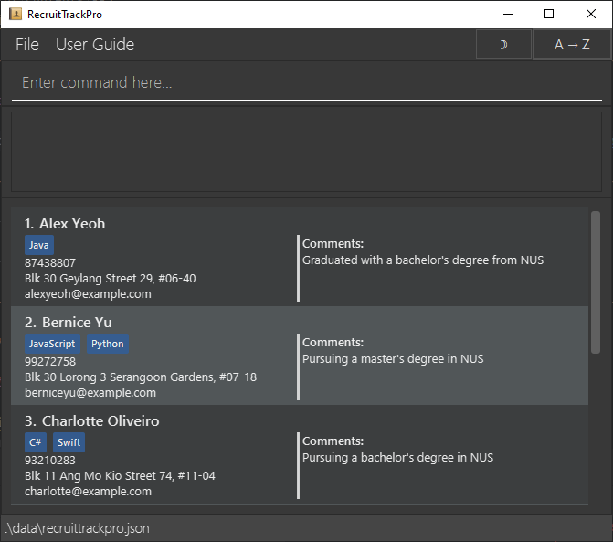

# RecruitTrackPro User Guide

RecruitTrackPro is a **desktop app for managing applicants, optimized for use via a Line Interface** (CLI) while still
having the benefits of a Graphical User Interface (GUI). If you can type fast, RecruitTrackPro can get your applicant
management tasks done faster than traditional GUI apps.

<!-- * Table of Contents -->
<page-nav-print />

--------------------------------------------------------------------------------------------------------------------

## Quick start

1. Ensure you have Java `17` or above installed in your Computer. 
   **Mac users:** Ensure you have the precise JDK version prescribed [here](https://se-education.org/guides/tutorials/javaInstallationMac.html).

2. Download the latest `.jar` file from [here](https://github.com/AY2425S2-CS2103-F15-3/tp/releases).

3. Copy the file to the folder you want to use as the _home folder_ for your RecruitTrackPro.

4. Open a command terminal, `cd` into the folder you put the jar file in, and use the `java -jar recruittrackpro.jar` command to run the application. 
   A GUI similar to the below should appear in a few seconds. Note how the app contains some sample data. 
   

5. Type the command in the command box and press Enter to execute it. e.g. typing **`help`** and pressing Enter will display all available commands. 
   Some example commands you can try:

   * `list` : Lists all candidates.

   * `add n/John Doe p/98765432 e/johnd@example.com a/John street, block 123, #01-01` : Adds a candidate named `John Doe` to the RecruitTrackPro.

   * `delete 3` : Deletes the 3rd candidate shown in the current list.

   * `clear` : Deletes all candidates.

   * `exit` : Exits the app.

6. Refer to the [Features](#features) below for details of each command.

<box type="tip" seamless>

**Tip:** Pressing Up and Down will traverse through the session's command history
</box>

--------------------------------------------------------------------------------------------------------------------

## Features

<box type="info" seamless>

**Notes about the command format:** 

* Words in `UPPER_CASE` are the parameters to be supplied by the user. 
  e.g. in `add n/NAME`, `NAME` is a parameter which can be used as `add n/John Doe`.

* Items in square brackets are optional. 
  e.g. `n/NAME [t/TAG]` can be used as `n/John Doe t/friend` or as `n/John Doe`.

* Items with `…`​ after them can be used multiple times including zero times. 
  e.g. `[t/TAG]…​` can be used as ` ` (i.e. 0 times), `t/friend`, `t/friend t/family` etc.

* Parameters can be in any order. 
  e.g. if the command specifies `n/NAME p/PHONE_NUMBER`, `p/PHONE_NUMBER n/NAME` is also acceptable.

* Extraneous parameters for commands that do not take in parameters (such as `help`, `list`, `exit` and `clear`) will be ignored. 
  e.g. if the command specifies `help 123`, it will be interpreted as `help`.

* For `e/EMAIL`, the email must follow a valid format: `local-part@domain`. 
  The local-part may include alphanumeric characters and special characters (`.`, `_`, `-`), but must **not** start or end with a special character, and must **not** contain **consecutive special characters** (e.g., `john..doe@example.com` is invalid). 
  The domain must contain at least one period, and end with a **Top-Level Domain (TLD)** of at least 2 letters.

* If you are using a PDF version of this document, be careful when copying and pasting commands that span multiple lines as space characters surrounding line-breaks may be omitted when copied over to the application.

</box>

### Viewing help: `help`

Shows a message that describes the functionality of each command.

Format: `help`

### Adding a candidate: `add`

Adds a candidate to the RecruitTrackPro.

Format: `add n/NAME p/PHONE_NUMBER e/EMAIL a/ADDRESS [t/TAG]… [c/COMMENT]`

<box type="tip" seamless>

**Tip:** A candidate can have any number of tags (including 0)
</box>

Examples:
* `add n/John Doe p/98765432 e/johnd@example.com a/John street, block 123, #01-01`
* `add n/Betsy Crowe t/python e/betsycrowe@example.com a/Newgate Prison p/1234567 t/java`
* `add n/Bruce Wayne e/bwayne@example.com a/Gotham City p/91234567 c/Owner of Wayne Enterprises`

### Listing all candidates: `list`

Shows a list of all candidates in the RecruitTrackPro.

Format: `list`

### Editing a candidate: `edit`

Edits an existing candidate in the RecruitTrackPro.

Format: `edit INDEX [n/NAME] [p/PHONE] [e/EMAIL] [a/ADDRESS] [t/TAG]… [c/COMMENT]`

* Edits the candidate at the specified `INDEX`. The index refers to the index number shown in the displayed candidate list. The index **must be a positive integer** 1, 2, 3, …​
* At least one of the optional fields must be provided.
* Existing values will be updated to the input values.
* When editing tags, the existing tags of the candidate will be removed i.e adding of tags is not cumulative.
* You can remove all the candidate’s tags by typing `t/` without
    specifying any tags after it.
* When editing the comment, the existing comment of the candidate will be overwritten.
* You can clear the candidate’s comment by typing `c/` without
  specifying any comment after it.

Examples:
*  `edit 1 p/91234567 e/johndoe@example.com` Edits the phone number and email address of the 1st candidate to be `91234567` and `johndoe@example.com` respectively.
*  `edit 2 n/Betsy Crower t/` Edits the name of the 2nd candidate to be `Betsy Crower` and clears all existing tags.
*  `edit 3 a/Gotham City c/` Edits the address and comment of the 3rd candidate to be `Gotham City` and empty respectively.

### Adding Tag(s) to a Candidate: `add-tags`

Adds one or more tags to an existing candidate in RecruitTrackPro.

Format: `add-tags INDEX t/tag [t/MORE_TAGS]…​`

* Adds the specified tag(s) to the candidate at the specified `INDEX`. The index refers to the number shown in the currently displayed candidate list. The index **must be a positive integer** (e.g., 1, 2, 3, ...).
* Tags are added **case-insensitively**. For example, `t/java` and `t/Java` are treated as the same tag.
* If a tag already exists for the candidate, it will **not** be added again. The system will notify the user of any **duplicate tag(s)**.
* New, unique tags will be added to the candidate, regardless of casing.

Examples:

*  `add-tags 1 t/Java Developer t/JSP Framework`  Adds the tags `Java Developer` and `JSP Framework` to the first candidate.
*  `add-tags 2 t/Java t/java`  Adds the tag `Java` to the second candidate (only once), the second tag `java` is ignored.
*  `add-tags 2 t/jaVa` Informs user that the tag `Java` already exists.

### Removing Tag(s) from a Candidate: `remove-tags`

Removes one or more tags from an existing candidate in RecruitTrackPro.

Format: `remove-tags INDEX t/TAG [t/MORE_TAGS]…`

* Removes the specified tag(s) from the candidate at the specified `INDEX`. The index refers to the number shown in the currently displayed candidate list. The index **must be a positive integer** (e.g., 1, 2, 3, ...).
* Tags removal is **case-insensitive** and requires an exact match. For example, `t/java` and `t/Java` are treated as the same tag, but `t/java` and `t/java developer` are not.
* Any specified tags that are not in the candidate's list will be listed as tags that **do not exist** for the candidate.
* Existing tags will be removed from the candidate, regardless of casing.

Examples:

*  `remove-tags 1 t/Java Developer t/c++`  Removes the tags `Java Developer` and `c++` from the first candidate.

### Editing a Tag of a Candidate: `edit-tag`

Edits one tag from an existing candidate in RecruitTrackPro.

Format: `edit-tag INDEX from/TAG to/TAG`

* Edits a specified tag of the candidate at the specified `INDEX`. The index refers to the number shown in the currently displayed candidate list. The index **must be a positive integer** (e.g., 1, 2, 3, ...).
* The tag specified by `from/TAG` **must be an exact match** in order to be edited, ignoring case sensitivity.  

Examples:

*  `edit-tag 1 from/Java Developer to/Python Developer`  Edits the first candidate's tag from `Java Developer` to `Python Developer`.

### Locating candidates: `find`

Find a candidate in RecruitTrackPro whose fields matches the keyword.

Format: `find OPTION [n/NAME MORE_NAME] [p/PHONE_NUMBER MORE_PHONE_NUMBER] [t/TAG MORE_TAG] 
   [a/ADDRESS MORE_ADDRESS] [e/EMAIL MORE_EMAIL] [c/COMMENT MORE_COMMENT]`

* At least one of the optional fields must be provided.
* The search is case-insensitive. e.g. `hans` will match `Hans`
* The order of the keywords does not matter. e.g. `Hans Bo` will match `Bo Hans`
* Only full words will be matched e.g. `Han` will not match `Hans`

Option: `--contain-all` `-ca`

Option changes the default behaviour of the find command from `OR` search to `AND` search.
* If `OPTION` is not provided, then candidates matching at least one keyword will be returned (i.e. `OR` search).
* If `OPTION` `--contain-all` or `-ca` is provided, then candidates matching all keyword will be returned (i.e. `AND` search).

Examples:
* `find n/John doe` returns `john` and `John Doe`
* `find --contain-all John doe` returns `John Doe`
* `find n/bernice t/python` returns `Bernice Yu, Roy Balakrishnan`
* `find -ca n/bernice t/python` returns `Bernice Yu`  

### Deleting a candidate: `delete`

Deletes the specified candidate from the RecruitTrackPro.

Format: `delete INDEX`

* Deletes the candidate at the specified `INDEX`.
* The index refers to the index number shown in the displayed candidate list.
* The index **must be a positive integer** 1, 2, 3, …​

Examples:
* `list` followed by `delete 2` deletes the 2nd candidate in the RecruitTrackPro.
* `find Betsy` followed by `delete 1` deletes the 1st candidate in the results of the `find` command.

### Switching the sorting order: `switch-sort`

Switches the alphabetical sorting order of candidates between ascending (A to Z) and descending (Z to A).

Format: `switch-sort`

### Clearing all entries: `clear`

Clears all entries from the RecruitTrackPro.

Format: `clear`

### Exiting the program: `exit`

Exits the program.

Format: `exit`

### Saving the data

RecruitTrackPro data are saved in the hard disk automatically after any command that changes the data. There is no need to save manually.

### Editing the data file

RecruitTrackPro data are saved automatically as a JSON file `[JAR file location]/data/recruittrackpro.json`. Advanced users are welcome to update data directly by editing that data file.

<box type="warning" seamless>

**Caution:**
If your changes to the data file makes its format invalid, RecruitTrackPro will discard all data and start with an empty data file at the next run.  Hence, it is recommended to take a backup of the file before editing it. 
Furthermore, certain edits can cause the RecruitTrackPro to behave in unexpected ways (e.g., if a value entered is outside the acceptable range). Therefore, edit the data file only if you are confident that you can update it correctly.
</box>

--------------------------------------------------------------------------------------------------------------------

## FAQ

**Q**: How do I transfer my data to another Computer? 
**A**: Install the app in the other computer and overwrite the empty data file it creates with the file that contains the data of your previous RecruitTrackPro home folder.

--------------------------------------------------------------------------------------------------------------------

## Known issues

1. **When using multiple screens**, if you move the application to a secondary screen, and later switch to using only the primary screen, the GUI will open off-screen. The remedy is to delete the `preferences.json` file created by the application before running the application again.
2. **If you minimize the User Guide Window** and then use the `User Guide` menu, or the keyboard shortcut `F1` again, the original User Guide Window will remain minimized, and no new User Guide Window will appear. The remedy is to manually restore the minimized User Guide Window.

--------------------------------------------------------------------------------------------------------------------

## Command summary

| Action            | Format, Examples                                                                                                                                                                               |
|-------------------|------------------------------------------------------------------------------------------------------------------------------------------------------------------------------------------------|
| **Add**           | `add n/NAME p/PHONE_NUMBER e/EMAIL a/ADDRESS [t/TAG]… [c/COMMENT]`   e.g., `add n/James Ho p/22224444 e/jamesho@example.com a/123, Clementi Rd, 1234665 t/java t/python`                    |
| **Delete**        | `delete INDEX`  e.g., `delete 3`                                                                                                                                                            |
| **Edit**          | `edit INDEX [n/NAME] [p/PHONE_NUMBER] [e/EMAIL] [a/ADDRESS] [t/TAG]… [c/COMMENT]`  e.g.,`edit 2 n/James Lee e/jameslee@example.com`                                                         |
| **Add Tag(s)**    | `add-tags INDEX t/TAG [t/MORE_TAGS]... `  e.g., `add-tags 1 t/Java Developer t/C# Developer`                                                                                                |
| **Edit Tag**      | `edit-tag INDEX from/OLD_TAG to/NEW_TAG `  e.g., `edit-tag 1 from/Java Developer to/JavaScript Developer`                                                                                   |
| **Remove Tag(s)** | `remove-tags INDEX t/TAG [t/MORE_TAGS]... `  e.g., `remove-tags 1 t/JavaScript Developer t/C# Developer`                                                                                    |
| **Find**          | `find OPTION [n/NAME MORE_NAME] [p/PHONE_NUMBER MORE_PHONE_NUMBER] [t/TAG MORE_TAG] [a/ADDRESS MORE_ADDRESS] [e/EMAIL MORE_EMAIL] [c/COMMENT MORE_COMMENT]`  e.g., `find -ca n/John t/Java` |
| **List**          | `list`                                                                                                                                                                                         |
| **Help**          | `help`                                                                                                                                                                                         |
| **Switch sort**   | `switch-sort`                                                                                                                                                                                  |
| **Clear**         | `clear`                                                                                                                                                                                        |
| **Exit**          | `exit`                                                                                                                                                                                         |
